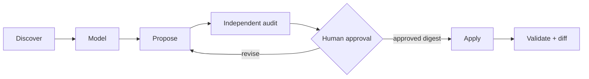
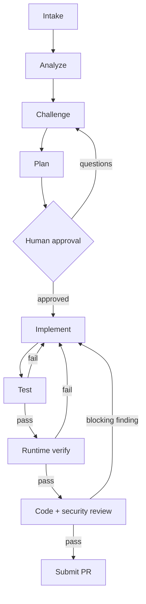

# Asterweave

**Graph paths woven into reliable delivery.**

Asterweave is a Claude Code plugin that adapts itself to your repository, then turns feature and defect delivery into an evidence-driven graph with bounded repair loops. The model reasons inside a graph node; deterministic Node scripts own state, attempt budgets, evidence, typed transitions, destructive-command guardrails, and the stop gate. A task succeeds only when acceptance criteria, tests, runtime verification, independent reviews, and PR state all have current evidence.

It does not impose Clean Architecture, DDD, CQRS, MVVM, or Redux. It discovers and preserves the architecture already present.

---

## Quick start

```text
1. /plugin marketplace add anjotadena/asterweave-marketplace
2. /plugin install asterweave@at-digital-labs
3. /plugin enable asterweave@at-digital-labs      → prompts for your GitHub token
4. /reload-plugins
5. /asterweave:doctor                             → confirms hooks, state, stack, MCP
6. /asterweave:scaffold --dry-run                 → preview repository context
7. /asterweave:scaffold                           → apply after approving the digest
```

Then deliver work:

```text
/asterweave:deliver owner/repository#123
```

## Requirements

| Requirement | Why |
| --- | --- |
| Claude Code 2.1.218+ | Plugin, skill, and hook APIs used here |
| Node.js 18+ | Deterministic hooks and state scripts |
| Git | Issue-to-PR delivery |
| Fine-grained GitHub token | Scoped to the repos and operations you allow |

The plugin ships **disabled by default**, because enabling it activates hooks and requests sensitive GitHub configuration.

---

## Installation

### From GitHub (recommended)

Run inside any Claude Code session:

```text
/plugin marketplace add anjotadena/asterweave-marketplace
/plugin install asterweave@at-digital-labs
/plugin enable asterweave@at-digital-labs
/reload-plugins
/asterweave:doctor
```

Claude Code prompts for the GitHub token on enable and stores it as sensitive plugin configuration. Never place tokens in `.mcp.json`, `.env`, source control, prompts, or issue comments.

### From a local clone

```bash
git clone https://github.com/anjotadena/asterweave-marketplace
```

Start Claude Code from the directory *containing* the clone, then:

```text
/plugin marketplace add ./asterweave-marketplace
/plugin install asterweave@at-digital-labs
/plugin enable asterweave@at-digital-labs
```

### For plugin development

```bash
claude --plugin-dir ./asterweave-marketplace/plugins/asterweave
```

### Verify a release before installing

```bash
npm run check                              # offline structural + behavioral validation
claude plugin validate ./plugins/asterweave
```

`npm run check` runs the manifest validator and the full unit suite; it needs no network. The `claude plugin validate` step requires Claude Code on the machine.

---

## How it works

Repository setup runs its own guarded graph:



Delivery runs the main graph, where every failure routes back to implementation rather than forward:



The workflow pauses for explicit approval after challenge and planning, and confirms commit, push, and PR details unless invoked with an intentional `--auto-pr`. It never merges, self-approves, dismisses reviews, bypasses checks, force-pushes, or deletes branches.

---

## Commands

| Command | Purpose |
| --- | --- |
| `/asterweave:scaffold` | Analyze and generate/refresh repository-specific Claude Code context |
| `/asterweave:analyze` | Read-only repository and impact analysis |
| `/asterweave:challenge` | Requirements/design challenge (the "grill" phase) |
| `/asterweave:plan` | Approval-ready implementation DAG |
| `/asterweave:implement` | Execute an approved plan |
| `/asterweave:test` | Add and run unit and integration/contract tests |
| `/asterweave:verify` | Verify real observable behavior |
| `/asterweave:review` | Independent staff and security review |
| `/asterweave:submit-pr` | Commit, push, and create/update a PR after gates pass |
| `/asterweave:deliver` | Run the full intake → PR graph |
| `/asterweave:daily` | Triage and pick up assigned work |
| `/asterweave:github-task` | `list`, `read`, `create`, `update`, `claim` |
| `/asterweave:resume` | Resume durable local graph state |
| `/asterweave:retro` | Improve the workflow from its event ledger |
| `/asterweave:doctor` | Diagnose plugin, state, hooks, stack, and MCP |

Use the individual stages when you do not want the complete workflow.

---

## Repository scaffolding

Run `/asterweave:scaffold` once when adopting a repository; use `--refresh` when its architecture, tooling, or policy changes. It reads existing instructions, code, tests, manifests, CI, and representative patterns before proposing anything.

It may create or update only evidence-backed repository context:

```text
CLAUDE.md
.claude/rules/*.md
.claude/skills/*/SKILL.md
.claude/agents/*.md
.claude/references/*.md
.claude/asterweave.json
.claude/asterweave-scaffold.json
```

Before writing, Asterweave shows an audited create/replace plan and asks you to approve its content digest. Apply then refuses stale file hashes, symlink/path escape, likely secrets, duplicate skill/agent names, broken links, invalid routes, unsafe quality commands, and unapproved drift. Refresh never deletes stale artifacts automatically.

The generator sizes output to the evidence: simple repositories get a small setup; monorepos and domain-heavy systems may get scoped rules, references, and specialists. Project skills double as the project's slash commands, so it does not duplicate them in the legacy `.claude/commands/` format.

Routing lives in `.claude/asterweave.json`. A stage can preload project skills, select a project agent, and add verified quality-gate commands. Project configuration may tighten Asterweave but **cannot** disable its approval, testing, runtime verification, independent review, security, evidence, or Git safety gates.

---

## GitHub token posture

All GitHub content is treated as untrusted data. Every state-changing MCP operation is previewed, confirmed, then read back for verification. The default MCP toolsets are deliberately narrower than `all`, to reduce context and authority.

Recommended fine-grained token:

- limit repository access to selected repositories;
- grant metadata and contents **read** for context;
- grant issues and pull requests **write** only if task/PR creation is required;
- grant Actions, code scanning, and secret scanning **read** only when needed;
- apply organization approval, expiration, and rotation policies.

---

## Durable state and evidence

```text
.claude/asterweave/state.json     current typed state
.claude/asterweave/events.jsonl   append-only history
```

Add `.claude/asterweave/` to your ignore rules unless your organization intentionally retains sanitized workflow evidence in version control. Never store secrets, raw customer data, or sensitive logs there.

State commands are documented in [`plugins/asterweave/references/graph-contract.md`](plugins/asterweave/references/graph-contract.md). The Stop hook continues an active workflow but lets the turn end at human approval or a typed blocked state; Claude Code's own continuation cap is an additional escape hatch.

---

## What is included

- **15 workflow skills** under the `/asterweave:` namespace.
- **13 specialist agents** — repository analysis, scaffold design/audit, requirements challenge, architecture, implementation, testing, runtime verification, staff review, security review, failure diagnosis, orchestration, and PR handling.
- **GitHub MCP connection** for issues, PRs, CI checks, code scanning, and secret scanning.
- **Cross-platform Node scripts** for stack detection, graph state/event history, plugin validation, test discovery, destructive-operation blocking, and evidence-aware continuation.
- **Progressive stack rule packs** for .NET/ASP.NET Core/WPF/WinForms, Angular/React/React Native/Node/Next/Nest/Electron, PHP/Laravel, WordPress, Python/Django, Flutter, and mobile concerns.
- **Unit tests** for graph routing, recovery, evidence replacement, stack discovery, scaffolding, and hooks.

Specialist agents have explicit tool allowlists: read-only reviewers cannot edit, and the PR agent cannot edit source. The orchestrator may spawn nested specialists, but descendants cannot widen session permissions. Asterweave parallelizes independent research and independent reviews, and serializes writes by default — parallel writers require separate worktrees/branches, explicit ownership, an integration order, and a final combined test run.

---

## Enterprise rollout

Host this repository under organization control, review releases, and pin approved versions or commit SHAs. Administrators can declare the marketplace and plugin in managed or project settings:

```json
{
  "extraKnownMarketplaces": {
    "at-digital-labs": {
      "source": {
        "source": "github",
        "repo": "anjotadena/asterweave-marketplace"
      }
    }
  },
  "enabledPlugins": {
    "asterweave@at-digital-labs": true
  }
}
```

Combine with managed `strictKnownMarketplaces`, permission deny rules, sandboxing, branch protection, required checks, CODEOWNERS, secret scanning, and human review. The plugin hook is not a replacement for platform policy.

---

## Repository layout

```text
.claude-plugin/marketplace.json    marketplace catalog (no version — plugin.json is authoritative)
plugins/asterweave/               the plugin itself
  .claude-plugin/plugin.json      authoritative version and user config
  .mcp.json                       GitHub MCP server, token via ${user_config.github_token}
  skills/ agents/ hooks/          workflow surface
  scripts/ schemas/ tests/        deterministic core
package.json                      npm run check → validate + test
```

## Migrating from LoopForge

The rename changes the plugin identity and command namespace. Finish or pause any active LoopForge workflow, disable and uninstall `loopforge@at-digital-labs`, then install Asterweave. Do not keep both enabled — they register equivalent hooks and GitHub MCP behavior.

Workflow state is not migrated automatically. To resume unfinished work, first verify `.claude/asterweave/` does not exist, then rename `.claude/loopforge/` to `.claude/asterweave/`. Keep a backup until `/asterweave:doctor` and `/asterweave:resume` confirm the state is valid.

## Design basis

Deterministic state graphs, bounded local agent loops, isolated specialist contexts, append-only evidence, progressive disclosure, and evaluator/implementer separation. Scaffolding follows the same principles: minimal always-loaded context, lazy path rules, on-demand skills and references, evidence-backed specialists, and an independent evaluator before mutation.

- [Claude Code plugin reference](https://code.claude.com/docs/en/plugins-reference)
- [Claude Code skills](https://code.claude.com/docs/en/skills)
- [Claude Code subagents](https://code.claude.com/docs/en/sub-agents)
- [Claude Code hooks](https://code.claude.com/docs/en/hooks)
- [Claude Code MCP](https://code.claude.com/docs/en/mcp)
- [GitHub's official MCP server](https://github.com/github/github-mcp-server)

## License

MIT © AT Digital Labs
