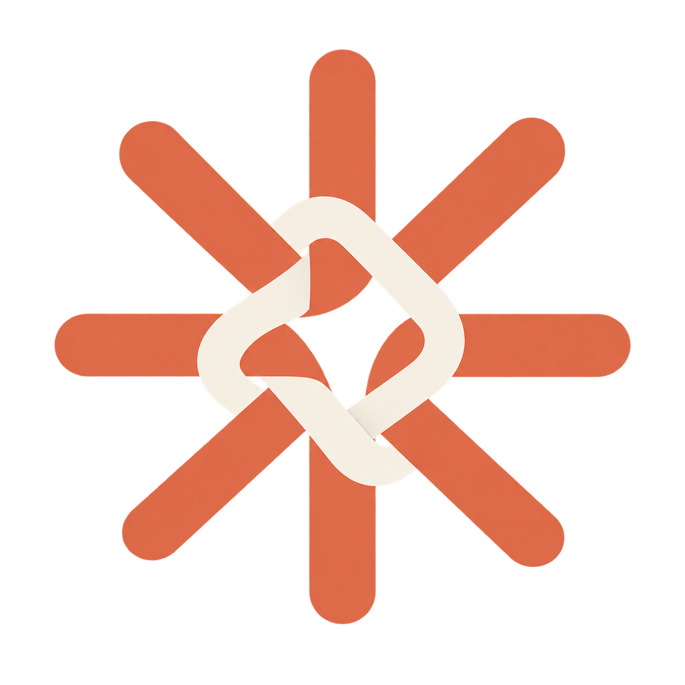
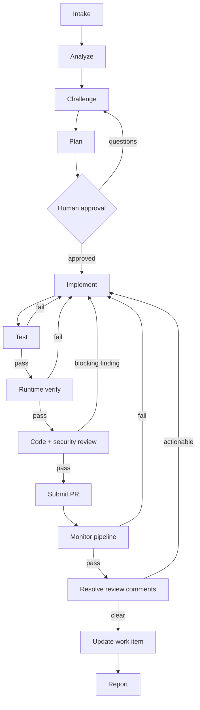

<p align="center">
  
</p>

<h1 align="center">Asterweave</h1>

<p align="center">
  Agentic software delivery for Claude Code.
</p>

<p align="center">
  <a href="https://anjotadena.github.io/asterweave/"></a>
  <a href="https://github.com/anjotadena/asterweave/actions/workflows/docs.yml"></a>
  <a href="./LICENSE"></a>
</p>

Asterweave understands your repository, coordinates specialized agents, implements a change, verifies it, and drives delivery toward a pull request — pausing for your approval at the decisions that stay yours to make.

It does not impose Clean Architecture, DDD, CQRS, MVVM, or Redux. It discovers and preserves whatever architecture is already there.

---

## Quick start

```text
/plugin marketplace add anjotadena/asterweave-marketplace
/plugin install asterweave@at-digital-labs
/plugin enable asterweave@at-digital-labs      → prompts for your GitHub token
/reload-plugins
/asterweave:doctor                             → confirms hooks, state, stack, MCP
```

Then, inside a repository:

```text
/asterweave:scaffold
```

Reads your code, tests, and CI, then proposes an evidence-backed `CLAUDE.md`, `.claude/rules/`, and `.claude/asterweave.json` for your approval — Asterweave's repository-onboarding step.

```text
/asterweave:deliver owner/repository#123
```

Analyzes the issue, plans the change, implements it, tests it, verifies it, runs independent code and security review, and opens a pull request — pausing for your approval after the plan, and again before push/PR unless invoked with `--auto-pr`.

Full walkthrough: **[Getting started →](https://anjotadena.github.io/asterweave/getting-started/installation)**

---

## Why Asterweave?

AI can generate code quickly. Autonomous coding becomes unreliable when requirements are ambiguous, agents don't understand the repository, context is lost between sessions, multiple agents duplicate responsibilities, tests aren't used as gates, external writes are assumed to succeed, pipelines fail after PR creation, or review comments pile up unhandled.

> **Asterweave provides capability. The repository provides context. Specifications provide intent. Tests provide proof.**

| | |
| --- | --- |
| **Asterweave** | Reusable agentic workflow — orchestration, generic agents, verification, retries, PR/pipeline handling |
| **Repository `.claude/`** | Repository-specific engineering knowledge — rules, domain agents, routing |
| **`specs/`** (optional) | Business/system intent — requirements, use cases, acceptance criteria |
| **Tests** | Executable proof, not a formality |
| **Workflow state** | Durable progress, so a session can be resumed rather than restarted |

---

## How it works

Delivery runs a deterministic graph, where every failure routes back to implementation rather than forward:



It never merges, self-approves, dismisses reviews, bypasses checks, or deletes branches. **[Full architecture →](https://anjotadena.github.io/asterweave/architecture/overview)**

---

## Daily workflow

```text
/asterweave:deliver 4821
```

Asterweave reads the ticket, loads repository context, plans, implements, tests, reviews, opens the PR, and monitors CI on its own. You review: ambiguous requirements it flags, important architecture decisions in the plan, and the resulting PR. You don't need to invoke every internal agent by hand — the graph decides which checks a change needs.

Run `/asterweave:scaffold` when adopting a repository or when its architecture/tooling changes meaningfully — not before every ticket.

**[Daily workflow guide →](https://anjotadena.github.io/asterweave/usage/daily-workflow)** · **[Cheat sheet →](https://anjotadena.github.io/asterweave/usage/cheat-sheet)**

---

## Asterweave vs. your repository

**Asterweave owns:** reusable orchestration, generic agents, delivery/verification/retry logic, PR and pipeline handling, workflow state.
**Repository `.claude/` owns:** architecture conventions, project rules, technology conventions, domain-specific agents, routing configuration.
**`specs/` owns:** requirements, constraints, use cases, acceptance criteria — read and linked by Asterweave, never generated by it.

```text
┌─────────────────────────────┐
│ ASTERWEAVE                  │
│ Reusable capability         │
│ Skills · Generic agents     │
│ Orchestration · Workflow    │
│ state                       │
└──────────────┬──────────────┘
               │
               ▼
┌─────────────────────────────┐
│ REPOSITORY                  │
│ .claude/ · specs/           │
│ src/ · tests/                │
└─────────────────────────────┘
```

> Do not duplicate Asterweave's workflows or generic agents inside a repository's `.claude/`.

**[Asterweave vs. the repository →](https://anjotadena.github.io/asterweave/concepts/plugin-vs-repository)**

---

## Commands

| Command | Purpose |
| --- | --- |
| `/asterweave:scaffold` | Align a repository's `.claude/` with evidence-backed context |
| `/asterweave:deliver <issue>` | Run the full intake → PR graph |
| `/asterweave:complete-project` | Audit an existing repository and finish its remaining modules with parallel workstreams |
| `/asterweave:analyze` / `/asterweave:challenge` | Understand and grill a task before planning |
| `/asterweave:review` | Independent staff **and** security review of a diff |
| `/asterweave:resume` | Resume durable workflow state |
| `/asterweave:daily` | Triage assigned work, read-only |
| `/asterweave:doctor` | Diagnose plugin/repository health |

**[Complete command reference →](https://anjotadena.github.io/asterweave/commands/overview)**

---

## What's included

- **17 workflow skills** under the `/asterweave:` namespace.
- **13 specialist agents**, least-privilege by design — read-only analyzers/reviewers, write-capable implementers/testers.
- **GitHub MCP** for issues, PRs, CI checks, and review comments, with an **optional Azure DevOps MCP** for organizations tracking work in Azure Boards instead.
- **Three deterministic hooks**: a destructive-command guard, an evidence-based stop gate, and a per-workstream ownership guard for parallel completion runs.
- **Progressive stack rule packs**: .NET/ASP.NET Core/WPF/WinForms, Angular/React/React Native/Node/Next/Nest/Electron, PHP/Laravel, WordPress, Python/Django, Flutter, and mobile concerns.

---

## Example

```text
/asterweave:deliver 4821
```

```text
ADO-4821 "Prevent duplicate refunds"
   ↓
FR-4821-01 / UC-4821-01   (proposed and approved, if specs/ exists)
   ↓
Implementation + tests
   ↓
Independent code + security review
   ↓
Pull Request #391
```

Asterweave handles the routine delivery. You remain responsible for ambiguous product decisions, high-risk changes, and final approval under your team's normal governance.

---

## Documentation

**[anjotadena.github.io/asterweave →](https://anjotadena.github.io/asterweave/)**

Getting started · Using Asterweave day to day · Architecture · Commands · Agents · Rules · Hooks · Repository integration · Specifications · Configuration · Troubleshooting · Contributing.

---

## Requirements

| Requirement | Why |
| --- | --- |
| Claude Code 2.1.218+ | Plugin, skill, and hook APIs used here |
| Node.js 18+ | Deterministic hooks and state scripts |
| Git | Issue-to-PR delivery |
| Fine-grained GitHub token | Scoped to the repos and operations you allow |
| Node.js 20+ (only for Azure DevOps) | Required by the official Azure DevOps MCP server |

The plugin ships **disabled by default** — enabling it activates hooks and requests GitHub configuration. Full details: **[Prerequisites →](https://anjotadena.github.io/asterweave/getting-started/prerequisites)**

---

## Contributing

```bash
npm install
npm run check   # validate manifest + run unit tests, offline
```

See **[Contributing →](https://anjotadena.github.io/asterweave/contributing/development)** for repository layout, testing, and documentation guidelines.

## License

[MIT](./LICENSE) © AT Digital Labs
