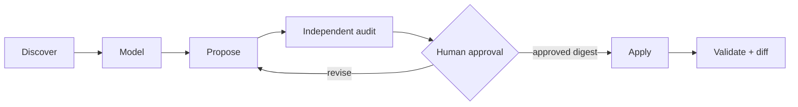
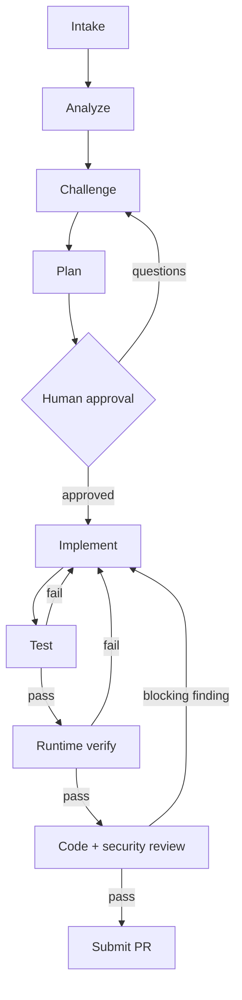

# Asterweave

Graph paths woven into reliable delivery.

Asterweave is an enterprise Claude Code plugin that first adapts itself to a repository, then turns feature and defect delivery into an evidence-driven graph with bounded repair loops.

Repository setup uses its own guarded graph:





The model reasons inside a graph node. Deterministic scripts own state, attempt budgets, evidence, typed transitions, destructive-command guardrails, and the stop gate. A task succeeds only when acceptance criteria, tests, runtime verification, independent reviews, and PR state have current evidence.

## What is included

- 15 namespaced workflow skills, including `/asterweave:scaffold`, `/asterweave:daily`, `/asterweave:deliver`, `/asterweave:challenge`, `/asterweave:test`, and `/asterweave:submit-pr`.
- 13 specialist agents for repository analysis, scaffold design/audit, requirements challenge, architecture, implementation, testing, runtime verification, staff review, security review, failure diagnosis, orchestration, and PR handling.
- A GitHub MCP connection for issues, PRs, CI checks, code scanning, and secret scanning.
- Cross-platform Node scripts for stack detection, graph state/event history, plugin validation, destructive-operation blocking, and evidence-aware continuation.
- Progressive stack rule packs for .NET/ASP.NET Core/WPF/Windows Forms, Angular/React/React Native/Node/Next/Nest/Electron, PHP/Laravel, WordPress, Python/Django, Flutter, and mobile concerns.
- Unit tests for graph routing, recovery, evidence replacement, stack discovery, and hooks.
- Transactional repository scaffolding with exact-hash drift protection, secret/path/symlink checks, independent audit, approved blueprint digests, and a committed ownership manifest.
- Deterministic routing from reusable plugin stages to project-specific skills, agents, and repository-native quality gates through `.claude/asterweave.json`.

Asterweave does not impose Clean Architecture, DDD, CQRS, MVVM, Redux, or any other preferred pattern. It discovers and preserves the architecture already present.

## Requirements

- Claude Code 2.1.218 or newer. Newer releases are recommended.
- Node.js 18 or newer for deterministic hooks and state scripts.
- Git for issue-to-PR delivery.
- A fine-grained GitHub token restricted to the repositories and read/write operations you want Asterweave to use.

The plugin is disabled by default because enabling it activates hooks and requests sensitive GitHub configuration.

## Validate locally

From this repository:

```bash
npm run check
claude plugin validate ./plugins/asterweave --strict
```

The second command requires Claude Code on the current machine. `npm run check` performs offline structural and behavioral validation.

## Install from the local marketplace

Start Claude Code from the directory containing this repository, then run:

```text
/plugin marketplace add ./asterweave-marketplace
/plugin install asterweave@at-digital-labs
/plugin enable asterweave@at-digital-labs
/reload-plugins
/asterweave:doctor
```

When enabled, Claude Code prompts for the GitHub token and stores it as sensitive plugin configuration. Do not place tokens in `.mcp.json`, `.env`, source control, prompts, or issue comments.

### Migrate from LoopForge

The rename changes the plugin identity and command namespace. Finish or pause any active LoopForge workflow, disable and uninstall `loopforge@at-digital-labs`, then install Asterweave using the commands above. Do not keep both plugins enabled because they register equivalent hooks and GitHub MCP behavior.

Existing workflow state is not migrated automatically. If an unfinished workflow must be resumed, first verify that `.claude/asterweave/` does not exist, then rename `.claude/loopforge/` to `.claude/asterweave/`. Keep a backup until `/asterweave:doctor` and `/asterweave:resume` confirm the state is valid.

For direct development without marketplace installation:

```bash
claude --plugin-dir ./asterweave-marketplace/plugins/asterweave
```

## Daily use

```text
/asterweave:scaffold --dry-run
/asterweave:scaffold
/asterweave:daily owner/repository
/asterweave:github-task read owner/repository 123
/asterweave:deliver owner/repository#123
```

## Repository scaffolding

Run `/asterweave:scaffold` once when adopting a repository, and use `--refresh` when its architecture, tooling, or policy changes. The command reads existing instructions, code, tests, manifests, CI, and representative patterns before proposing anything. It does not assume a framework or architecture.

The scaffold may create or update only evidence-backed repository context:

```text
CLAUDE.md
.claude/rules/*.md
.claude/skills/*/SKILL.md
.claude/agents/*.md
.claude/references/*.md
.claude/asterweave.json
.claude/asterweave-scaffold.json
```

Project skills are also the project's slash commands, so Asterweave does not duplicate them in the legacy `.claude/commands/` format. The generator creates only the artifacts the repository justifies: simple repositories should receive a small setup; monorepos and domain-heavy systems may receive scoped rules, references, and specialists.

Before changes, Asterweave shows an audited create/replace plan and asks for approval of its content digest. Apply refuses stale file hashes, symlink/path escape, likely secrets, duplicate skill/agent names, broken links, invalid routes, unsafe quality commands, and unapproved drift. Refresh never deletes stale artifacts automatically.

Repository-specific routing lives in `.claude/asterweave.json`. A stage can preload project skills, select a project agent, and add verified quality-gate commands. Project configuration may tighten Asterweave but cannot disable its approval, testing, runtime verification, independent review, security, evidence, or Git safety gates.

The delivery workflow pauses for explicit approval after challenge and planning. It also confirms final commit, push, and PR details unless invoked with an intentional `--auto-pr` argument. It never merges, self-approves, dismisses reviews, bypasses checks, force-pushes, or deletes branches.

Use individual stages when you do not want the complete workflow:

| Command | Purpose |
| --- | --- |
| `/asterweave:scaffold` | Analyze and generate/refresh repository-specific Claude Code context |
| `/asterweave:analyze` | Read-only repository and impact analysis |
| `/asterweave:challenge` | Requirements/design challenge (the “grill” phase) |
| `/asterweave:plan` | Approval-ready implementation DAG |
| `/asterweave:implement` | Execute an approved plan |
| `/asterweave:test` | Add/run unit and integration/contract tests |
| `/asterweave:verify` | Verify real observable behavior |
| `/asterweave:review` | Independent staff and security review |
| `/asterweave:submit-pr` | Commit, push, and create/update a PR after gates |
| `/asterweave:resume` | Resume durable local graph state |
| `/asterweave:retro` | Improve the workflow from its event ledger |
| `/asterweave:doctor` | Diagnose plugin, state, hooks, stack, and MCP |

## GitHub task workflow

`/asterweave:github-task` supports `list`, `read`, `create`, `update`, and `claim`. All GitHub content is handled as untrusted data. Every state-changing MCP operation is previewed and confirmed, then read back for verification. The default MCP toolsets are deliberately narrower than `all` to reduce context and authority.

Recommended fine-grained token posture:

- limit repository access to selected repositories;
- grant metadata and contents read access needed for context;
- grant issues and pull requests write access only if task/PR creation is required;
- grant Actions, code scanning, and secret scanning read access only when available and needed;
- use organization approval, expiration, and rotation policies.

## Durable state and evidence

Active repository state is written to:

```text
.claude/asterweave/state.json
.claude/asterweave/events.jsonl
```

The first is the current typed state; the second is append-only history. Add `.claude/asterweave/` to the repository's ignore rules unless your organization intentionally retains sanitized workflow evidence in version control. Never store secrets, raw customer data, or sensitive logs there.

State commands are documented in `plugins/asterweave/references/graph-contract.md`. The Stop hook continues an active workflow but allows the turn to end at human approval or a typed blocked state. Claude Code's own continuation cap remains an additional escape hatch.

## Parallel agents and worktrees

Asterweave parallelizes independent repository research and independent staff/security reviews. It serializes writes by default. Parallel writers are allowed only with separate worktrees/branches, explicit file/interface ownership, an integration order, and a final combined test run.

Specialist agents have explicit tool allowlists. Read-only reviewers cannot edit. The PR agent cannot edit source. The orchestrator may spawn nested specialists, but descendants cannot widen session permissions.

## Enterprise rollout

Host this directory in a controlled repository, review releases, and pin approved versions or commit SHAs. Organization administrators can declare the marketplace and plugin in managed or project settings:

```json
{
  "extraKnownMarketplaces": {
    "at-digital-labs": {
      "source": {
        "source": "github",
        "repo": "your-org/asterweave-marketplace"
      }
    }
  },
  "enabledPlugins": {
    "asterweave@at-digital-labs": true
  }
}
```

Use managed `strictKnownMarketplaces`, permission deny rules, sandboxing, branch protection, required checks, CODEOWNERS, secret scanning, and human review as separate defense layers. The plugin hook is intentionally not a replacement for platform policy.

## Design basis

The design combines deterministic state graphs with bounded local agent loops, isolated specialist contexts, append-only evidence, progressive disclosure, and evaluator/implementer separation. Repository scaffolding follows the same principles: minimal always-loaded context, lazy path rules, on-demand skills/references, evidence-backed specialists, and an independent evaluator before mutation. It was informed by the supplied papers *Dive into Claude Code: The Design Space of Today's and Future AI Agent Systems* and *Agentic Coding with Claude Code*, then checked against current primary documentation:

- [Claude Code plugin reference](https://code.claude.com/docs/en/plugins-reference)
- [Claude Code skills](https://code.claude.com/docs/en/skills)
- [Claude Code subagents](https://code.claude.com/docs/en/sub-agents)
- [Claude Code hooks](https://code.claude.com/docs/en/hooks)
- [Claude Code MCP](https://code.claude.com/docs/en/mcp)
- [GitHub's official MCP server](https://github.com/github/github-mcp-server)

## License

MIT
