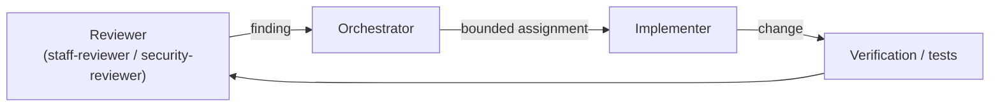

# Agent overview

Asterweave ships **thirteen specialist agents** — Markdown files under `plugins/asterweave/agents/` with a frontmatter tool allowlist and a scoped system prompt. Each graph node delegates to one, either a plugin agent by default or a project-specific agent configured through [agent routing](/architecture/agent-routing).

## Executor / evaluator separation

Read-only analyzers and reviewers cannot edit files; only implementers and testers can write, and only within their assigned scope. This separation means the agent that reviews a change is never the agent that wrote it.

| Agent | Read | Write | Role |
| --- | :---: | :---: | --- |
| [`repo-analyzer`](/agents/repo-analyzer) | ✅ | — | Repository discovery |
| [`requirements-challenger`](/agents/requirements-challenger) | ✅ | — | Requirements challenge |
| [`architect`](/agents/architect) | ✅ | — | Implementation planning |
| [`implementer`](/agents/implementer) | ✅ | ✅ | Bounded implementation |
| [`test-engineer`](/agents/test-engineer) | ✅ | ✅ (tests only) | Test design and execution |
| [`verification-engineer`](/agents/verification-engineer) | ✅ | — | Runtime acceptance verification |
| [`staff-reviewer`](/agents/staff-reviewer) | ✅ | — | Staff-level code review |
| [`security-reviewer`](/agents/security-reviewer) | ✅ | — | Independent security review |
| [`pr-engineer`](/agents/pr-engineer) | ✅ | — (Git/MCP only) | PR, pipeline, and work-item operations |
| [`failure-analyst`](/agents/failure-analyst) | ✅ | — | Diagnosing repeated failures |
| [`scaffold-architect`](/agents/scaffold-architect) | ✅ | — | Repository scaffold design |
| [`scaffold-auditor`](/agents/scaffold-auditor) | ✅ | — | Independent scaffold audit |
| [`orchestrator`](/agents/orchestrator) | ✅ | ✅ | Coordinates every other agent |

## Reviewer → implementer loop

A finding never gets fixed by the agent that raised it — it routes back through the orchestrator to `implementer`, then the change is re-verified and re-reviewed.

## Repository-specific agents

A repository can define its own agents under `.claude/agents/*.md` and route a graph stage to one through `.claude/asterweave.json`. Create one only for genuinely bounded, recurring **domain** expertise a generic Asterweave agent cannot reasonably provide — for example `finance-domain-reviewer` for regulated settlement logic. Do not create one for generic code review, generic security review, or generic implementation; Asterweave already provides those. See [Repository-specific agents](/repositories/scaffolding#repository-specific-agents) and [Asterweave vs. the repository](/concepts/plugin-vs-repository).

## Related

[Agent routing](/architecture/agent-routing) — how a graph stage resolves to a plugin or project agent.
