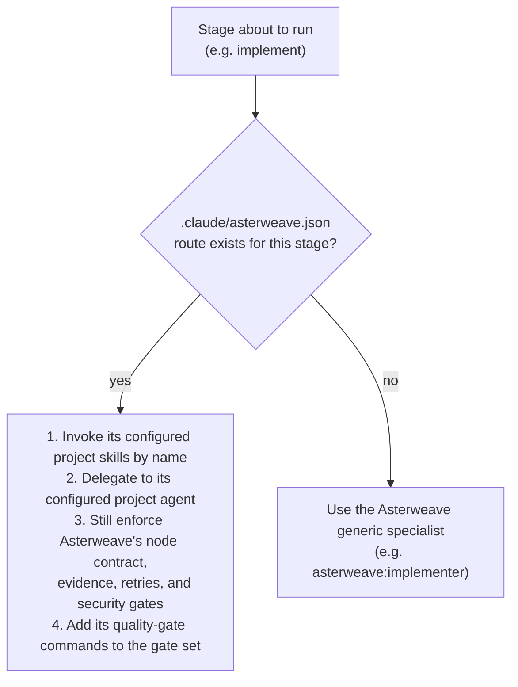

# Agent routing

Asterweave does not hardcode which agent runs each graph stage. Before every routable stage, the invoked skill runs:

```text
node "${CLAUDE_PLUGIN_ROOT}/scripts/scaffold-repo.mjs" route <stage> --root .
```

## Routable stages

`analyze`, `challenge`, `plan`, `implement`, `test`, `verify`, `review`, `submit-pr`, `monitor-pipeline`, `resolve-review-comments`, and `update-work-item`.

`intake` and `approve` are **never** routable — they are always Asterweave-owned.

## Precedence



If `.claude/asterweave.json` is invalid, or a routed skill/agent name doesn't exist, or managed scaffold artifacts have drifted from what was approved, write stages are blocked until the problem is resolved — Asterweave does not silently fall back.

## Example

```json title=".claude/asterweave.json"
{
  "version": 1,
  "provider": {"workItems": "github"},
  "routing": {
    "implement": {
      "agent": "payments-implementer",
      "skills": ["payments-domain", "tenant-security"]
    },
    "test": {
      "agent": "payments-test-engineer",
      "skills": ["integration-test-harness"]
    }
  }
}
```

Here, `implement` delegates to a repository-defined `payments-implementer` agent (having first invoked the `payments-domain` and `tenant-security` project skills), and `test` delegates to `payments-test-engineer` (via `integration-test-harness`). Every unrouted stage — `analyze`, `challenge`, `plan`, `verify`, `review`, and the rest — falls back to Asterweave's generic specialists (`asterweave:repo-analyzer`, `asterweave:requirements-challenger`, `asterweave:architect`, and so on).

## What routing can and cannot do

Project configuration may **add** quality-gate commands and **narrow** permissions. It **cannot**:

- skip human approval;
- skip evidence, testing, runtime verification, or independent review;
- skip security review;
- skip Git-safety rules;
- widen a subagent's tool permissions beyond what the plugin's own agents allow.

Project agents outrank plugin agents when names collide, so adapters use explicit project names and never the `asterweave:` namespace. Project skills are similarly unscoped, while plugin skills remain under `/asterweave:*`.

## Why this exists

A repository with genuine domain complexity (regulated finance flows, a legacy migration in progress, multi-tenant data isolation rules) may need a specialist Asterweave's generic agents cannot reasonably encode. Routing lets that repository plug a narrow, purpose-built agent into exactly the stage that needs it, without reimplementing the rest of the delivery graph, its retries, or its safety gates.

## Related

- [`asterweave.json` reference](/configuration/asterweave-json) for the full schema.
- [Adding a repo-specific agent](/repositories/scaffolding#repository-specific-agents).
- [Asterweave vs. the repository](/concepts/plugin-vs-repository) for when a project agent is (and isn't) justified.
