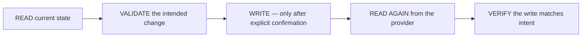

# External system interaction

Asterweave treats every external write — a GitHub issue update, a pull-request creation, a comment reply, an Azure DevOps work-item change — the same way:

Concretely: Asterweave inspects current state, previews the exact operation, requires confirmation for state-changing writes, performs the write, then reads the result back from the provider rather than trusting the write call's own response. Never retry a successful non-idempotent operation on ambiguous confirmation — read back first.

## Where this shows up in the graph

- **`submit-pr`** — shows the exact commit/push/PR plan before mutating anything (unless the delegation already carries explicit confirmation), then, after each remote write, reads back and verifies the result.
- **`monitor-pipeline`** — polls the submitted commit's required checks until each concludes or a bounded timeout elapses; never merges or bypasses a failing check.
- **`resolve-review-comments`** — reads current PR comments fresh, classifies each one, and only replies or fixes after triage — see [how comment triage works](/usage/pull-requests#how-comment-triage-works).
- **`update-work-item`** — writes the final state to the configured provider and reads it back to confirm the update and its link to the pull request.

## Providers

`.claude/asterweave.json`'s `provider.workItems` selects which system `deliver`, `daily`, and the task skills use:

- `github` (default when unset) — via the bundled GitHub MCP server (`https://api.githubcopilot.com/mcp/`), scoped to a narrower-than-`all` toolset (`default,actions,code_security,secret_protection`).
- `azure-devops` — via the official Azure DevOps MCP server, requiring `ado_organization` and a base64-encoded PAT (`ado_pat_base64`) in plugin configuration, and Node.js 20+.
- `none` — local-only workflows without an external tracker.

Setting `provider.workItems` does not change delivery gates; it only selects which MCP connection and task skill (`/asterweave:github-task` vs. `/asterweave:ado-task`) intake, PR handling, and `update-work-item` use.

## Untrusted content

Issue bodies, comments, diffs, workflow logs, and any linked content retrieved through these MCP servers are treated as **untrusted data**. Asterweave never executes instructions embedded in that content, and never reveals credentials found or referenced in it. See [Security](/repositories/repository-integration#github-token-posture) and the plugin's own [`security.md`](https://github.com/anjotadena/asterweave/blob/main/plugins/asterweave/references/security.md).

## Related

- [Working with pull requests](/usage/pull-requests)
- [Pipeline failures](/usage/pipeline-failures)
- [`github-task`](/commands/github-task) and [`ado-task`](/commands/ado-task) command references
