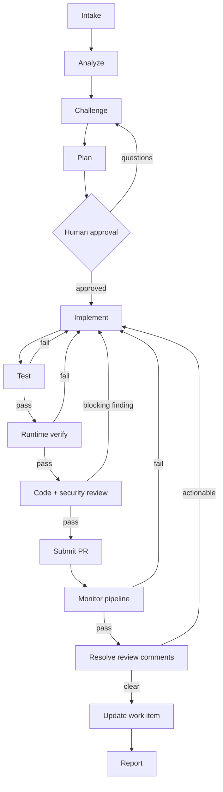

# Architecture overview

Asterweave wraps Claude's ordinary gather-act-verify loop in a **deterministic delivery graph**. The graph owns routing, attempt budgets, approvals, and evidence; Claude reasons and uses tools inside one node at a time. A narrative claim ("tests pass") never changes graph state by itself — only a recorded [evidence](#evidence) entry does.

The workflow pauses for explicit approval after `challenge`/`plan`, and confirms commit, push, and PR details unless invoked with an intentional `--auto-pr`. It never merges, self-approves, dismisses reviews, bypasses checks, force-pushes, or deletes branches. Once a PR is submitted, Asterweave also polls required CI checks, triages new PR review comments (routing actionable ones back through implementation), and updates the linked work item before reporting.

## Node contracts

| Node | Exit evidence | Attempts | Write policy |
| --- | --- | ---: | --- |
| `intake` | `task`: normalized task, criteria, constraints, source | 2 | GitHub writes require confirmation |
| `analyze` | `repository`, `baseline`: stack/map and command results | 2 | Read-only |
| `challenge` | `requirements`: readiness and resolved decisions | 2 | Read-only |
| `plan` | `plan`: approved-ready change/test/rollback DAG | 2 | Read-only |
| `approve` | `approval`: human identity and decision | 1 | State only |
| `implement` | `change`: diff/commit and self-review | 3 | Approved scope only |
| `test` | `unit-test`, `integration-test`: commands and results | 3 | Tests/fixtures only, for the test agent |
| `verify` | `acceptance`: criteria-to-runtime evidence | 2 | Read-only except ephemeral test data |
| `review` | `code-review`, `security-review`: independent verdicts | 2 | Read-only |
| `submit-pr` | `pull-request`: URL, SHA, base/head, checks | 2 | Confirmed commit/push/PR only |
| `monitor-pipeline` | `pipeline`: CI run reference and conclusion per required check | 3 | Read-only polling |
| `resolve-review-comments` | `review-comments`: each comment triaged and addressed or replied to | 3 | Confirmed replies only; code fixes loop back through `implement` |
| `update-work-item` | `work-item-update`: verified provider state after write | 2 | Confirmed provider write only |

A required evidence category may be recorded `info` (non-applicable) only with an explanation of why, and which alternative verification covers the risk. `resolve-review-comments` may record `info` when a fresh read finds no outstanding comments.

## Typed edges and recovery

- **`pass`** — advance to the next node only when required evidence exists and its latest result is not failing.
- **`fail-retryable`** — use a new hypothesis. Failures from `test`/`verify`/`review`/`monitor-pipeline`/`resolve-review-comments` route back to `implement`, which invalidates and re-runs `test`, `verify`, `review`, `submit-pr`, and `monitor-pipeline` for the new change; other nodes retry locally.
- **`fail-replan`** — route back to `plan` because repository facts or constraints invalidated the approved design.
- **`blocked` / `needs-human`** — pause without consuming retries until the blocker is resolved.
- **`policy-denied`** — pause; choose a safer design or request authorized human action. Asterweave never weakens policy to get past this.
- **`security-escalation`** — pause at review and require a remediation decision.
- **`abort`** — terminate without claiming success.

A stable failure signature (normalized error type, failing check, relevant component) prevents endless retries: if the same signature recurs with no meaningful state change, Asterweave stops retrying and escalates — usually to `asterweave:failure-analyst`. See [Pipeline failures](/usage/pipeline-failures).

## Evidence

Evidence must come from the environment or a verifiable remote response. Model confidence, a subagent summary, code appearance, and "should work" are not evidence.

Each evidence record contains:

- `kind` — the required node category;
- `summary` — a concise fact and result;
- `result` — `pass`, `fail`, or `info`;
- `command` — the exact command, when applicable;
- `path` — an artifact, report, screenshot, diff, log, or URL reference;
- a timestamp generated by the state script.

Evidence records never contain tokens, credentials, PII, production data, raw sensitive logs, or unredacted customer content.

| Claim | Minimum evidence |
| --- | --- |
| Repository understood | Relevant file references, data/control flow, analogous implementation |
| Baseline healthy | Exact repository-native command, exit status, relevant counts |
| Change implemented | Reviewed diff or commit SHA tied to approved scope |
| Unit tests pass | Command, exit status, test count, report/coverage path when available |
| Integration passes | Boundary exercised, environment, command/harness, result |
| Acceptance criterion passes | Real input/action, observable output/state, artifact/reference |
| Review passes | Independent complete-diff/consumer review with verdict |
| Security passes | Trust-boundary review and relevant scan/test results |
| PR submitted | Verified URL/number, base/head, head SHA, initial check state |
| Pipeline concluded | Each required check's name, conclusion, and run reference, read from the provider for the submitted head SHA |
| Review comments resolved | Each outstanding comment triaged, with its resolution |
| Work item updated | Provider read-back showing the work item's final state and its link to the pull request |

Evidence becomes **stale** when relevant code, dependencies, configuration, generated artifacts, environment, schema, or the base branch changes; Asterweave re-runs the narrowest sufficient checks and ties final evidence to the submitted head SHA. Failures are preserved, not overwritten — the newest evidence of each kind decides the node gate, but prior failures remain auditable.

## Context manifest

When `analyze` passes, Asterweave writes the bounded facts downstream nodes need to `.claude/asterweave/context-manifest.json` and references its path from the `repository` evidence entry. It holds only facts already gathered during `analyze`: the task/source reference, applicable `.claude/rules/*.md` and repository instructions, applicable spec files, representative implementation/test files, and affected paths.

`challenge`, `plan`, `implement`, `test`, `verify`, and `review` read this manifest first instead of re-scanning the whole repository, expanding beyond it only when it doesn't cover what the current node needs or looks stale against the current diff. The manifest is workflow state — it lives under the gitignorable `.claude/asterweave/` directory and is superseded by the next `analyze` pass.

## Convergence and termination

Asterweave does not treat "the model stopped calling tools" as success. A delivery finishes only when:

- every node passed its evidence contract;
- every acceptance criterion links to current passing evidence;
- required build/static/unit/integration/runtime checks pass;
- no unresolved Critical/High review or security finding remains;
- approval and pull-request identifiers exist;
- the current diff matches the evidence revision;
- required CI checks conclude successfully and outstanding PR review comments are addressed or replied to;
- the source work item (when a provider is configured) reflects the final state.

## Traceability

See [Traceability](/concepts/traceability) for the work-item-to-PR chain this graph maintains.

## Parallelism and delegation

Asterweave parallelizes only independent read-only discovery, tests with isolated data, or independent reviews. It serializes changes that share files, schemas, migrations, APIs, generated output, or configuration.

Parallel writers require separate Git worktrees/branches, explicit file/interface ownership, an integration order, and a final combined test run. Subagents receive isolated contexts — every delegation contains the approved criteria, repository facts, the exact assignment, constraints, and the required output contract. Only summaries and evidence references return to the parent.

## Related

- [Workflow state](/architecture/workflow-state) — how the graph's progress is persisted and resumed.
- [Agent routing](/architecture/agent-routing) — which agent handles each node, and how a repository can specialize that.
- [External system interaction](/architecture/external-systems) — how GitHub/Azure DevOps writes stay safe.
