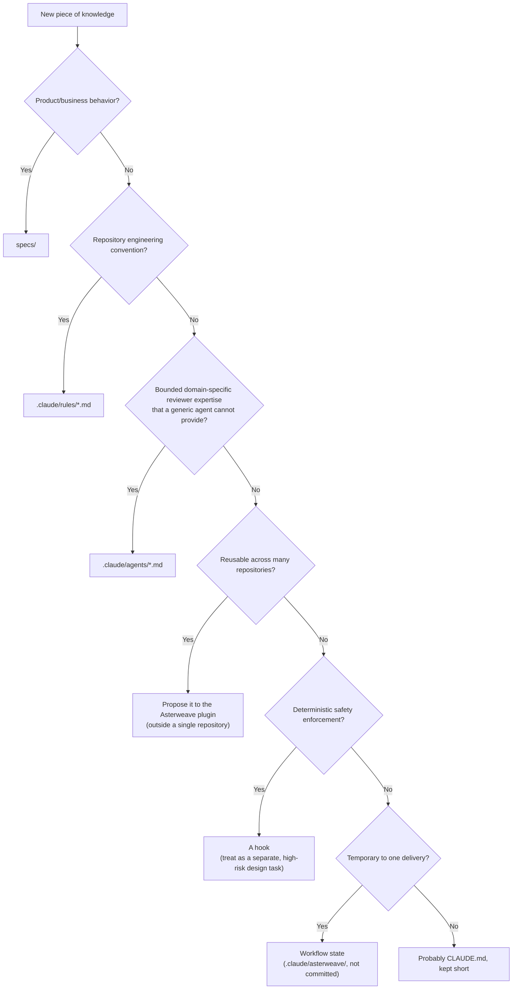

# Asterweave vs. the repository

This is the single most important distinction for using Asterweave well. Getting it wrong produces either a repository that fights the plugin, or a plugin that has been quietly reimplemented per-repository and has drifted from its safety guarantees.

```text
┌───────────────────────────────┐
│ ASTERWEAVE (the plugin)       │
│ Reusable capability            │
│                                │
│ 16 workflow skills             │
│ 13 generic specialist agents   │
│ 2 hooks (destructive-op guard, │
│   evidence stop gate)          │
│ Graph orchestration + state    │
│ GitHub / Azure DevOps MCP      │
└───────────────┬────────────────┘
                │ routes to, reads
                ▼
┌───────────────────────────────┐
│ REPOSITORY                     │
│                                │
│ CLAUDE.md                      │
│ .claude/rules/*.md             │
│ .claude/agents/*.md (optional) │
│ .claude/asterweave.json        │
│ specs/ (optional, if it exists)│
│ src/, tests/                   │
└───────────────────────────────┘
```

## Asterweave owns

- the delivery graph and its node contracts, attempt budgets, and typed edges;
- the sixteen `/asterweave:*` skills and thirteen generic specialist agents;
- destructive-command blocking and the evidence stop gate;
- durable workflow state and the append-only event ledger;
- GitHub/Azure DevOps MCP interaction: issues, PRs, CI checks, review comments;
- the evidence contract — what counts as proof a claim is true.

## Repository `.claude/` owns

- `CLAUDE.md` — short, stable, always-loaded facts about the repository;
- `.claude/rules/*.md` — path-scoped conventions (backend, database, security, ...);
- `.claude/agents/*.md` — **only** genuinely domain-specific specialists a generic Asterweave agent cannot reasonably provide (see [Repository agents](/repositories/scaffolding#repository-specific-agents));
- `.claude/asterweave.json` — routing to project skills/agents per stage, plus required quality-gate commands (see [asterweave.json reference](/configuration/asterweave-json));
- project skills under `.claude/skills/` — reusable, repository-specific workflows, which also double as the repository's own slash commands.

## `specs/` owns (when a repository has one)

- functional requirements (`FR-###`) and quality attributes (`NFR-###`);
- constraints (`C-###`) the design must respect;
- use cases (`UC-###`) — actors, preconditions, main/alternate flows, postconditions;
- domain vocabulary.

Asterweave never generates `specs/`. It reads and links to one your repository already has, and can propose creating or updating a single use case for a normal/complex change under explicit approval. See [Specifications](/concepts/specifications).

## The rule that keeps these from colliding

> **Do not duplicate Asterweave's workflows, generic agents, or safety gates inside a repository's `.claude/` configuration.**

Concretely:

- Don't write a repository `deliver.md` command — Asterweave's `/asterweave:deliver` already exists globally.
- Don't write a generic `code-reviewer` or `security-reviewer` agent — Asterweave's `asterweave:staff-reviewer` and `asterweave:security-reviewer` already exist. Write `finance-domain-reviewer` only if it holds bounded, recurring domain expertise those generic reviewers cannot provide.
- Don't write a repository hook that re-blocks `git push --force` — Asterweave's `PreToolUse` hook already does that. Write a repository hook only for enforcement Asterweave genuinely does not cover.
- Don't put product requirements in `CLAUDE.md` — that belongs in `specs/`, read by `analyze` and `challenge`.

`/asterweave:scaffold` applies exactly this classification when it proposes changes: every existing `.claude/agents/*.md` is judged `KEEP` (bounded domain expertise), `MERGE` (fold real domain rules into a rule file, drop the agent), or `REMOVE` (duplicates a generic Asterweave role) — never by file name, by actual responsibility. See [Repository scaffolding](/repositories/scaffolding).

## A decision tree for new project knowledge



## Next

- [Repository scaffolding](/repositories/scaffolding) — what `/asterweave:scaffold` actually detects, writes, preserves, and refuses to delete.
- [Rules](/rules/overview) — the difference between plugin-enforced policy and project rules.
- [Agent routing](/architecture/agent-routing) — how `.claude/asterweave.json` connects the two sides.
