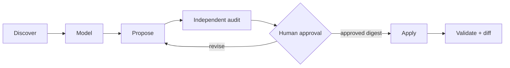

# Repository scaffolding

`/asterweave:scaffold` is Asterweave's repository-onboarding command — there is no separate `bootstrap` command; this is the real name. It is a **reconciler**, not a one-shot generator: run it once when adopting Asterweave in a repository, and again with `--refresh` when architecture, tooling, or policy changes meaningfully. It should not normally run before every ticket — see [When to scaffold](/usage/overview#when-to-scaffold).

Repository scaffolding is its own approval-gated graph, separate from delivery:



## What it can create or update

Only, and only after your approval:

```text
CLAUDE.md
.claude/rules/*.md
.claude/skills/*/SKILL.md
.claude/agents/*.md
.claude/references/*.md
.claude/asterweave.json
```

| Need | Artifact | Rule |
| --- | --- | --- |
| Short, stable, always-applicable facts | `CLAUDE.md` | Keep concise; link detail instead of duplicating it |
| File or directory conventions | `.claude/rules/*.md` | Requires `paths` frontmatter; each rule stays cohesive |
| Repeatable knowledge or workflow | `.claude/skills/<name>/SKILL.md` | Preferred over legacy `.claude/commands` — a project skill is also a slash command |
| Isolated specialist role | `.claude/agents/*.md` | Created only when bounded expertise, context isolation, or tool restrictions justify it |
| Detailed architecture/domain/test material | `.claude/references/*.md` | Linked directly from instructions, rules, skills, or agents |
| Deterministic routing and gates | `.claude/asterweave.json` | Routes may tighten or specialize the graph, never weaken mandatory gates |

It does **not** create legacy `.claude/commands`, hooks, MCP servers, permission grants, or deployment automation as part of normal scaffolding — each of those is treated as a separate, high-risk design and approval task.

## What it detects

- an existing `CLAUDE.md`, `.claude/`, nested instructions, and any generated ownership manifest;
- languages, frameworks, dependency manifests, lock files, and supported runtime versions;
- module boundaries, entry points, architecture, DI, validation, authentication/authorization, data, messaging, caching, observability, and external contracts;
- test organization, fixtures, integration harnesses, coverage policy, and CI commands;
- build, lint, format, static-analysis, run, migration, and deployment commands, read from repository files — never guessed;
- coding patterns from several representative production and test files;
- an existing `specs/` directory, if present, and its structure;
- every existing `.claude/agents/*.md` — what it actually does, not just its file name;
- existing repository-level hook configuration, if any;
- Git status and unrelated user changes, which it preserves rather than touching.

## What it preserves

Useful content from every existing target it proposes replacing — `operation: replace` always includes the exact current SHA-256 and folds in prior useful content rather than discarding it. Stale managed artifacts are never deleted automatically; they're flagged for an explicit keep/update/remove decision. A hand-edited file is never overwritten merely because a prior scaffold generated it.

## What it removes (with your approval)

Content that duplicates something Asterweave's plugin already provides globally — a repository `deliver` command, a generic code-reviewer agent, a hook re-blocking a force-push the plugin's own hook already blocks. See the worked example below.

## What it never removes automatically

Anything not explicitly approved for removal in the digest. Refresh runs never delete stale artifacts on their own — a keep/update/remove decision is always surfaced separately.

## Existing agent classification

For every existing `.claude/agents/*.md`, scaffolding compares its **actual responsibility** against Asterweave's generic agent roster — not its file name:

- **`KEEP`** — bounded, recurring domain expertise a generic agent cannot provide (a finance-settlement reviewer, a legacy-migration reviewer).
- **`MERGE`** — overlaps a generic role but adds real domain rules; those rules fold into a `.claude/rules/*.md` file, and the agent is removed.
- **`REMOVE`** — duplicates a generic Asterweave role under a different name with no added domain value.

This classification is always presented as part of the proposal's conflicts/decisions — never applied silently.

## Repository-specific agents

Create a `.claude/agents/*.md` file only for genuinely domain-specific knowledge a generic Asterweave agent cannot reasonably provide:

**Create one for:** regulated domain rules (finance, healthcare), a legacy migration in progress, multi-tenant isolation logic specific to your data model.

**Don't create one for:** generic code review, generic security review, generic implementation, generic test writing — Asterweave's plugin agents already cover these. See [Asterweave vs. the repository](/concepts/plugin-vs-repository).

## Worked example

**Before:**

```text
.claude/
├── commands/
│   └── deliver.md
├── agents/
│   ├── code-reviewer.md
│   └── finance-reviewer.md
├── hooks/
│   └── block-force-push.sh
└── CLAUDE.md
```

**After (once approved):**

```text
.claude/
├── rules/
│   ├── backend.md
│   ├── database.md
│   └── security.md
├── agents/
│   └── finance-reviewer.md
├── asterweave.json
└── CLAUDE.md
```

- `commands/deliver.md` removed → superseded by the plugin's own `/asterweave:deliver`.
- `agents/code-reviewer.md` removed → duplicates `asterweave:staff-reviewer`, a generic plugin agent.
- `hooks/block-force-push.sh` removed → duplicates enforcement the plugin's own `PreToolUse` hook already provides.
- `agents/finance-reviewer.md` retained → genuine project-specific domain knowledge, `KEEP`-classified.
- `.claude/rules/*.md` and `.claude/asterweave.json` added → evidence-backed conventions and routing extracted from the repository itself.

## The approval flow

1. `inventory` runs and evidence candidates are read.
2. A transient `.claude/asterweave/scaffold-proposal.json` is produced against the blueprint schema — not a committed artifact.
3. `asterweave:scaffold-auditor` independently reviews the proposal.
4. The proposed paths, create/replace operations, conflicts, assumptions, and validation warnings are shown; you approve the exact returned digest.
5. `apply` writes only that approved digest. It refuses path traversal, symlinks, stale hashes, secrets, duplicate definitions, invalid routing, and unapproved content drift.
6. `verify` inspects the complete Git diff and validates relevant repository commands.

## Flags

| Flag | Effect |
| --- | --- |
| `--dry-run` / `--check` | Preview the digest without writing anything |
| `--refresh` | Reconcile an already-scaffolded repository against current evidence |

See the full [`/asterweave:scaffold` command reference](/commands/scaffold).

## Related

[The `.claude` directory](/repositories/claude-directory), [`asterweave.json` reference](/configuration/asterweave-json), [Repository maintenance](/usage/repository-maintenance).
