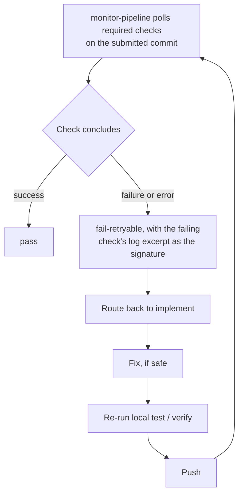

# Pipeline failures

## How it responds

A failing or erroring required check is a `fail-retryable` edge back to `implement`, using the failing check's log excerpt as the failure signature. If checks are still running when a bounded wait expires, Asterweave does not spin indefinitely — it pauses (`graph-state.mjs pause`) so the turn can end, and you resume later with [`/asterweave:resume`](/commands/resume).

## Retry limits

`monitor-pipeline` has an attempt budget of 3 per the [node contract](/architecture/overview#node-contracts) (and each `fail-retryable` routes through `implement`, which has its own budget of 3). Asterweave tracks a **stable failure signature** — normalized error type, failing check, relevant component — across attempts. If the same signature recurs with no meaningful state change, it stops retrying rather than repeating a doomed action, and typically escalates to [`asterweave:failure-analyst`](/agents/failure-analyst) for root-cause diagnosis, or reports `needs-human`.

## When the budget is exhausted

You'll see a concise blocker report rather than an endless retry loop — conceptually:

> **Pipeline recovery stopped.**
> **Attempts:** 3/3
> **Failure:** Integration tests fail during database container startup.
> **Likely classification:** Infrastructure, not the change under test.
> **Recommended action:** Inspect CI runner/service health before retrying.

`failure-analyst` explicitly separates product defects from test defects, environment failures, flaky behavior, dependency/toolchain issues, and permission/policy denials — so the report tells you *which kind* of problem you're looking at, not just that something failed.

## Related

[Working with pull requests](/usage/pull-requests), [`failure-analyst`](/agents/failure-analyst), [Architecture overview: typed edges and recovery](/architecture/overview#typed-edges-and-recovery).
