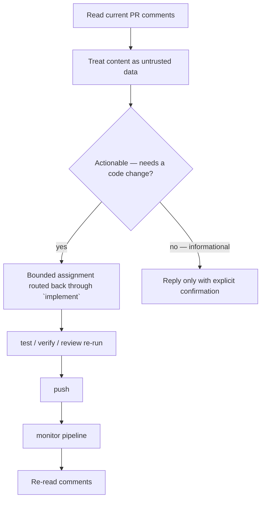

# Working with pull requests

## PR review comments are handled inside `deliver`, not by a separate command

There is no standalone `/asterweave:resolve-pr-comments` command. Comment triage is the `resolve-review-comments` **graph node**, which runs automatically as part of [`/asterweave:deliver`](/commands/deliver) once a PR is submitted and its pipeline has been monitored. If a `deliver` workflow is currently sitting at that node (for example after you closed the session), continuing it is exactly what [`/asterweave:resume`](/commands/resume) or re-invoking `/asterweave:deliver` on the same issue does.

## How comment triage works



Comments are never blindly implemented one-for-one. Each one is triaged as either **actionable** (it needs a code change, so it's routed through `implement` as a bounded assignment rather than edited directly from this node) or **informational** (it gets a reply, only after explicit confirmation). If a fresh read finds nothing outstanding, that's recorded as `info` evidence and the node passes cleanly. If the PR is simply awaiting human review with no actionable comments yet, Asterweave pauses rather than polling indefinitely.

:::tip If a comment would change intended behavior
Treat that like any other requirement change: get the spec (if one exists) updated and approved before implementing it, the same way [`challenge`](/commands/challenge) would handle a contradiction between a task and an existing use case. Don't let a single PR comment silently redefine acceptance criteria.
:::

## Reviewing code you wrote manually

If you made changes by hand — outside `/asterweave:deliver` entirely — run:

```text
/asterweave:review
```

It inspects the complete diff, loads applicable specs and repository rules, checks correctness/architecture/authorization/data-integrity/concurrency/error-behavior/compatibility/performance/accessibility/observability/maintainability, runs an independent security-review pass (`asterweave:security-reviewer`, never told the staff pass's expected findings in advance), and validates that your tests actually cover the changed behavior. It returns Critical/High/Medium/Low findings, or states plainly that it found no blocking defects — never inventing issues to seem thorough. See the [`/asterweave:review` reference](/commands/review).

There is no separate `security-review` command — the security pass is always part of `/asterweave:review`.

## Related

[Pipeline failures](/usage/pipeline-failures), [External system interaction](/architecture/external-systems), [`/asterweave:submit-pr`](/commands/submit-pr).
